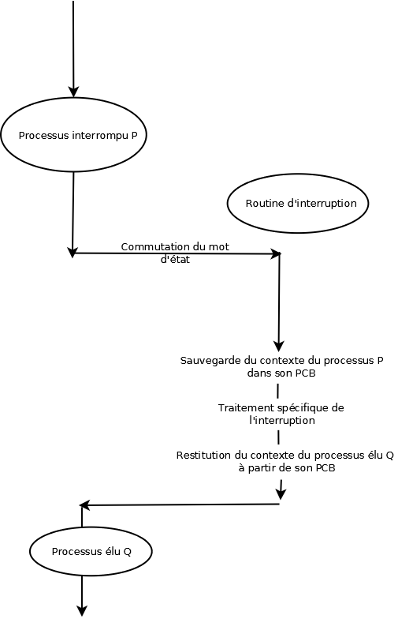

# TD1 - To Remember

## Multiprogrammation et temps partagé

### Définition des systèmes

Nous nous mettons dans le cas où on lance l'execution de deux programmes `p1` et `p2` dans différents types de systèmes. On parlera de programme ou de processus ici ; tout en sachant qu'un programme est statique en mémoire, et qu'un processus est son execution auquel on permet l'utilisation du CPU.

#### Monoprogrammé

Le CPU sera bloqué lors de l'execution d'une entrée sortie sur un des deux programmes. Les programmes s'executent l'un après l'autre.

#### Multiprogrammé

Lorsqu'un processus va effectuer une opération d'entrée sortie, alors l'autre va pouvoir etre executé par le CPU le temps que l'opération soit effectuée.

#### A temps partagé

Pour répartir l'allocution du CPU à tel ou tel processus, on leur alloue un **quantum**, représentatant une durée d'execution. Si le quantum est d'une seconde, alors le processus va s'executer une seconde avant de passer la main à un autre. Le quantum sera mis à jour au fur et à mesure de l'execution du programme.

#### Calcul du taux d'occupation

Pour chacun des systèmes on est capable de calculer le taux d'occupation du CPU, en mettant en rapport le nombre d'unité de temps nécessaire pour l'execution de `p1` et de `p2`, avec les unités de temps où le CPU était effectivemet occupé.

## Notion de processus

### Définition générales

**CO** *(registre)* : Compteur Ordinal qui contient l'adresse de la prochaine instruction (permet de savoir où on en est dans l'execution du programme)  
**Mot d'état**/**PSW** *(registre)*  : Program Status Word,  indique l'état du processus (voir plus bas), le mode d'executiion (maitre/esclave), le masque d'interruption, le CO...  
**Accumulateur** *(registre)* : stocke les résultats des opérations arithmétiques et logiques  
**Mot mémoire** : Nombre de bits que le processus peut traiter en une opération  

### Etat des processus dans un systeme

**Bloqué**/En attente : En attente d'une opération d'entrée sortie. *File d'attente nécessaire*.  
**Pret** : Pret à être executé. *File d'attente nécessaire*.   
**En Execution** : En train d'être executé.

#### Priorité
Un processus peut être prioritaire sur les autres. Cette priorité peut être incrémentée ou décrémentée en fonction du modèle de priorité choisi.  
*Par exemple*, si on veut prioriser les processus qui font le plus d'entrées sorties, on incrémente la priorité de 3 lorsqu'il effectue une ES, et on le décrémente de 2 (sauf si déjà à 0) à chaque quantum où il n'en fait pas.

### PCB

Le PCB d'un processus est du type

PCB |
---|
pid|
etat|
CO, FLAG|
Registres : Ax Bx Cx Dx |
Priorité|
Quantum|
Causes blocages|  
 |
*Pointeur vers le PCB suivant* →|

## Petits programmes en assembleur

### La boucle multiplication

| Programme | Assembleur |
| :------------- | :------------- |
| `var j ` ` j=3*2 ` ` Ecrire j`| `MOV DX,0`  `MOV EX,2`  `mul : ADD DX,3`  `MOV DX,CX`  `SUB EX,1`  `MOV EX,CX`  `MOV EX,CX`  `JNZ EX , mul`  `OUT`  |

### Lecture et ecriture

| Programme |  Assembleur (avec variables) | Assembleur (sans variables) |
| :------------- | :------------- |:------------- |
| `var i,k ` ` k=3 ` ` Lire i`   `k=k+1`   `Ecrire k`| `MOV @0,3`  `IN`  `MOV @1, DX`  `MOV AX,@0`  `MOV BX,@1`  `ADD AX,BX`  `MOV DX,CX`  `OUT`  |`MOV DX,3`  `IN`  `ADD DX , CX`  `MOV DX,CX`  `OUT`    |

### A retenir :

* Le résultat d'une opération arithmétique est stockée dans CX
* Le code et les variables sont stockées dans des régions mémoires différentes
* IN/OUT : écrit/retourne la valeur de DX

## Commutation de contexte

C'est une composante essentielle de la gestion des processus. Elle execute deux actions (de manière atomique):
* Range dans la mémoire le contenu du PSW courant
* Charge PSW

Lors d'un appel au superviseur (voir plus bas), une commutation de contexte est faite.

## Mécanismes d'interruption

### Routine d'interruption

#### Forme générale  

1. On sauvegarde le masque actuel
2. On met à jour le masque avec le numero d'interruption.
3. On met à jour le CO du PCB
4. On sauvegarde le contenu de l'accumulateur dans le PCB
5. On active le systeme d'interruption
    * On effectue le code d'interruption (affiche d'un message par exemple)
6. On désactive le systeme d'interruption
7. On remet à jour l'accumulateur précédemment sauvegardé dans le PCB
8. On remet à jour `RM` avec la valeur précédemment sauvegardée dans le PCB
9. On réactive le systeme d'interruption
10. On effectue le branchement vers le CO qui avait été enregistré dans le PCB.

*Remarque : les instructions 9 et 10 doivent être atomiques pour que le branchement ai lieu et donc que le programme continue de s'executer normalement*

#### Gestion de priorité par masques

On peut gérer la priorité entre `n` interruptions avec un masque. Ce masque `RM` sera un tableau de `n` colonnes initialisées à 1.
Chaque colonne représente une cause d'interruption et signifie si celle-ci peut prendre la main sur l'interruption actuelle. On initialise à 1 de sorte à ce que n'importe quelle interruption puisse prendre le pas.  

Exemple :
On a les interruptions Ex,A,B,C,D et E.

`RM` :
| Ex | A | B | C | D | E |
| :------------- | :------------- | :------------- | :------------- | :------------- | :------------- |
| 1 | 1 | 1 | 1 | 1 | 1 |

Chaque interruption aura également un tableau de `n` colonnes, initialisée à 0 pour l'indice où elles sont prioritaires, et à 1 où elles peuvent être interrompues.  

Ici on représente ici `masque[B]` :
| Ex | A | B | C | D | E |
| :------------- | :------------- | :------------- | :------------- | :------------- | :------------- |
| 1 | 1 | 0 | 0 | 0 | 0 |

→ aucune interruption à part Ex et A ne peut la stopper (qui peut m'stopper?)

### Notion d'appel au superviseur ou SVC

#### Définition rapides
**SVC** : SuperVisor Call, appel à partir d'un processus executé en mode esclave (a.k.a. *utilisateur*) à une fonction qui s'execute en mode maître (a.k.a. *system*). Il provoque une **communtation de contexte**.

#### Petit calcul d'horloge
On a un compteur décrémenté de 1 toutes les $5 \mu s$. Une prise de mesure doit être faite toutes les $100ms$. On a donc un temps d'horloge de :  

$\frac{100\times10^{-3}}{5 \times10^{-6}}$

#### Application à la prise de mesure

On veut faire de manière périodique des prélèvements. Un prelevement est un appel système : on va utiliser un SVC et donc provoquer une commutation de contexte. A chaque *tic d'horloge* on veut prélever une mesure : ainsi on effectue la commutation de contexte (sauvegarde du PCB actuel), on prélève (*appel SVC*), affiche les mesures (*appel SVC*), réinitialise notre horloge (*appel SVC*) et puis restauront le PCB courant en remettant à jour le PSW avec celui préalablement sauvegardé dans le PCB.

#### Moniteur d'enchainement

Deux cas de figures s'offrent à nous : soit le délai est dépassé alors on doit alerter que le délai est dépassé et changer de processus, soit la tâche est terminée et on change simplement de processsus.
Changer de processus signifie :

1. Détruire le processus actuel
2. Charger le processus suivant
3. SVC pour réinitialiser l'horloge
4. Mettre à jour le PSW avec le PCB du nouveau processus

*Remarque : les étapes 3,4 et 5 correspondent aux actions faites par le moniteur d'enchaînement.*
